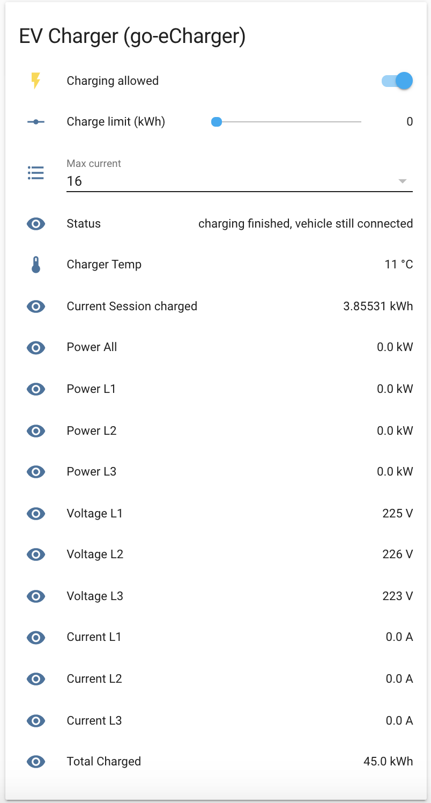

# Homeassistant integration for the go-eCharger (WIP)

Integration for Homeassistant to view and Control the go-eCharger for electric Vehicles

# Warning: WIP - Breaking changes possible
This is the first version of the Integration so there are still breaking chnages possible.


# Installation

- clone this repository
```
git clone https://github.com/cathiele/homeassistant-goecharger.git
```
- copy the content of the `custom_components`-Folder to the `custom_components` folder of your home-assistant installation

```
# mkdir -p <your-ha-config-dir>/custom_components
# cp -r custom_components/goecharger <your-ha-config-dir>/custom_components
```

* setup your Charger in the `configuriation.yml`

```yml
goecharger:
  host: <ip of your charger>
```

# Sample View
